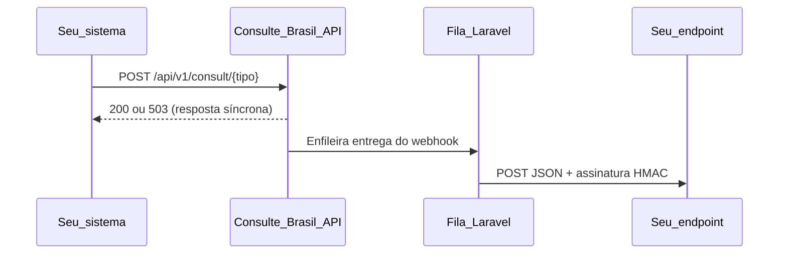

# Webhook de consultas

Notificações **de saída** enviadas pelo Consulte Brasil quando uma consulta é concluída — com sucesso ou com falha total dos provedores (reembolso automático).

O webhook é **opcional**: consultas via API e painel funcionam normalmente sem configuração.

---

## Visão geral



1. A consulta termina na mesma requisição HTTP (síncrona).
2. Se a conta tiver webhook configurado, um job é enfileirado **depois** da persistência.
3. Um worker de fila (`queue:work`) envia o POST para a URL cadastrada.
4. A entrega é assíncrona — não aumenta a latência da API.

---

## Configuração

### Painel web

Acesse **Webhook** no menu do cliente (`/client/webhook`):

- Informe a URL de destino (HTTPS em produção).
- O **secret** é gerado automaticamente e fica **visível no painel** enquanto o webhook estiver ativo (com opção de ocultar e botão copiar).
- Use **Regenerar secret** se precisar rotacionar a chave.
- Use **Remover** para desativar notificações.

### API

Autenticação: `Authorization: Bearer cb_live_…`

#### Consultar configuração

```http
GET /api/v1/webhook
```

Resposta:

```json
{
  "data": {
    "webhook_url": "https://seu-sistema.com/webhooks/consulte",
    "webhook_configured": true
  }
}
```

O secret **nunca** é retornado neste endpoint após a criação.

#### Definir ou atualizar

```http
PUT /api/v1/webhook
Content-Type: application/json

{
  "webhook_url": "https://seu-sistema.com/webhooks/consulte"
}
```

Na primeira configuração (ou ao regenerar), a resposta inclui o secret **uma vez**:

```json
{
  "data": {
    "webhook_url": "https://seu-sistema.com/webhooks/consulte",
    "webhook_configured": true,
    "webhook_secret": "abc123..."
  }
}
```

#### Remover webhook

```http
PUT /api/v1/webhook
Content-Type: application/json

{
  "webhook_url": null
}
```

#### Regenerar secret

```http
PUT /api/v1/webhook
Content-Type: application/json

{
  "regenerate_secret": true
}
```

Mantém a URL atual e retorna um novo `webhook_secret` na resposta.

### Regras de URL

| Ambiente | Regra |
|----------|-------|
| Produção | Apenas `https://` |
| Desenvolvimento | `https://` ou `http://localhost` / `http://127.0.0.1` |

---

## Quando o webhook é enviado

| Situação | Webhook enviado? | `status` no payload |
|----------|------------------|---------------------|
| Consulta concluída com sucesso | Sim | `success` |
| Consulta atendida via cache | Sim | `success` (`from_cache: true`) |
| Todos os provedores falharam (reembolso) | Sim | `refunded` |
| Saldo insuficiente (402) | Não | — |
| Tipo de consulta inválido (404) | Não | — |
| Conta sem webhook configurado | Não | — |

Consultas feitas pelo **painel web** ou pela **API pública** disparam o mesmo webhook (mesma conta).

---

## Requisição HTTP enviada ao seu endpoint

| Campo | Valor |
|-------|-------|
| Método | `POST` |
| Content-Type | `application/json` |
| User-Agent | `ConsulteBrasil-Webhook/1.0` |
| Assinatura | Header `X-Consulte-Signature` |
| Timeout | 10 segundos |

Responda com **HTTP 2xx** para confirmar recebimento. Qualquer outro status é tratado como falha e dispara retentativas.

---

## Payload

### Evento

Sempre `consultation.completed`.

### Sucesso

```json
{
  "event": "consultation.completed",
  "consultation_id": "01932a1b-8c4d-7000-8000-000000000001",
  "status": "success",
  "query_type": "cpf",
  "amount_charged": 29,
  "from_cache": false,
  "provider": "cpfcnpj",
  "data": {
    "name": "JOAO DA SILVA",
    "birth_date": "1990-01-15"
  }
}
```

### Falha com reembolso

Quando todos os provedores falham, o cliente **não é cobrado** e o webhook informa a falha:

```json
{
  "event": "consultation.completed",
  "consultation_id": "01932a1b-8c4d-7000-8000-000000000002",
  "status": "refunded",
  "query_type": "cpf",
  "amount_charged": 29,
  "from_cache": false,
  "error": {
    "code": "all_providers_failed"
  }
}
```

### Campos

| Campo | Tipo | Descrição |
|-------|------|-----------|
| `event` | string | Sempre `consultation.completed` |
| `consultation_id` | string (UUID) | Identificador único da consulta |
| `status` | string | `success` ou `refunded` |
| `query_type` | string | Código do tipo (ex.: `cpf`, `cnpj`) |
| `amount_charged` | int | Valor cobrado em centavos de BRL |
| `from_cache` | bool | `true` se a resposta veio do cache |
| `provider` | string | Identificador do provedor (quando disponível) |
| `data` | object | Resultado da consulta (apenas em `success`) |
| `error` | object | Detalhe da falha (apenas em `refunded`) |
| `error.code` | string | Código da falha (ex.: `all_providers_failed`) |

---

## Validação da assinatura

Cada POST inclui o header:

```
X-Consulte-Signature: t=1718812345,v1=3f2a1b...
```

### Algoritmo

1. Leia o corpo **bruto** da requisição (string JSON exata, sem reformatar).
2. Extraia `t` (timestamp Unix) e `v1` (assinatura hex) do header.
3. Rejeite se `|agora - t| > 300` segundos (5 minutos).
4. Calcule: `HMAC-SHA256(secret, t + "." + corpo_bruto)`.
5. Compare com `v1` usando comparação segura (`hash_equals` em PHP, `crypto.timingSafeEqual` em Node).

### Exemplo em PHP

```php
$secret = 'seu-webhook-secret';
$payload = file_get_contents('php://input');
$header = $_SERVER['HTTP_X_CONSULTE_SIGNATURE'] ?? '';

$parts = [];
foreach (explode(',', $header) as $piece) {
    [$k, $v] = array_pad(explode('=', trim($piece), 2), 2, null);
    if ($k !== null && $v !== null) {
        $parts[trim($k)] = trim($v);
    }
}

$t = $parts['t'] ?? null;
$v1 = $parts['v1'] ?? null;

if ($t === null || $v1 === null || abs(time() - (int) $t) > 300) {
    http_response_code(401);
    exit;
}

$expected = hash_hmac('sha256', $t.'.'.$payload, $secret);

if (! hash_equals($expected, $v1)) {
    http_response_code(401);
    exit;
}

$event = json_decode($payload, true, flags: JSON_THROW_ON_ERROR);
// Processar $event...
http_response_code(200);
```

### Exemplo em Node.js

```javascript
import crypto from 'crypto';

function verifyWebhook(rawBody, signatureHeader, secret) {
  const parts = Object.fromEntries(
    signatureHeader.split(',').map((p) => p.trim().split('='))
  );

  const timestamp = Number(parts.t);
  const signature = parts.v1;

  if (!timestamp || !signature || Math.abs(Date.now() / 1000 - timestamp) > 300) {
    return false;
  }

  const expected = crypto
    .createHmac('sha256', secret)
    .update(`${timestamp}.${rawBody}`)
    .digest('hex');

  return crypto.timingSafeEqual(Buffer.from(expected), Buffer.from(signature));
}
```

> **Importante:** use o corpo **exatamente como recebido**. Re-serializar o JSON pode alterar a assinatura.

---

## Retentativas

Se o endpoint não responder com 2xx, ou houver erro de rede/timeout:

| Tentativa | Espera antes da próxima |
|-----------|-------------------------|
| 1ª falha | 30 segundos |
| 2ª falha | 120 segundos |
| 3ª falha | 300 segundos |

Após 3 tentativas, o job é marcado como falho (`php artisan queue:failed`).

Não há replay automático além dessas retentativas. Garanta idempotência no seu endpoint usando `consultation_id` como chave.

---

## Requisitos em produção

### Worker de fila

O webhook depende de um processo contínuo processando a fila:

```bash
php artisan queue:work database --sleep=3 --tries=3 --timeout=90
```

Recomendado: **Supervisor** (ou systemd) mantendo o worker ativo. Após cada deploy:

```bash
php artisan queue:restart
```

### Variáveis de ambiente

```env
QUEUE_CONNECTION=database   # ou redis
APP_KEY=...                 # necessário para criptografar o webhook_secret
APP_ENV=production          # exige URLs HTTPS no cadastro
```

### Logs

Falhas de entrega são registradas no canal `consultation`:

- `consultation.webhook.delivery_failed` — endpoint respondeu HTTP não-2xx
- `consultation.webhook.delivery_error` — timeout, DNS, conexão recusada, etc.

---

## Boas práticas no seu endpoint

1. **Valide a assinatura** antes de processar o payload.
2. **Responda rápido** (200 OK) e processe em background se necessário.
3. **Seja idempotente** — a mesma `consultation_id` pode ser reenviada em retentativas.
4. **Use HTTPS** em produção.
5. **Rotacione o secret** periodicamente via painel ou API.
6. **Não exponha o secret** em repositórios ou logs.

---

## Testando

1. Use [webhook.site](https://webhook.site) ou um servidor local (ngrok) para obter uma URL de teste.
2. Cadastre a URL em `/client/webhook` ou via `PUT /api/v1/webhook`.
3. Execute uma consulta de teste.
4. Verifique se o POST chegou com header `X-Consulte-Signature` e payload `consultation.completed`.

Para inspecionar a fila:

```bash
php artisan queue:monitor database:default
php artisan queue:failed
```

---

## Documentação relacionada

- API interativa (Scalar): `/docs/api` — grupo **Webhook**
- Endpoints de consulta: `POST /api/v1/consult/{queryType}`
